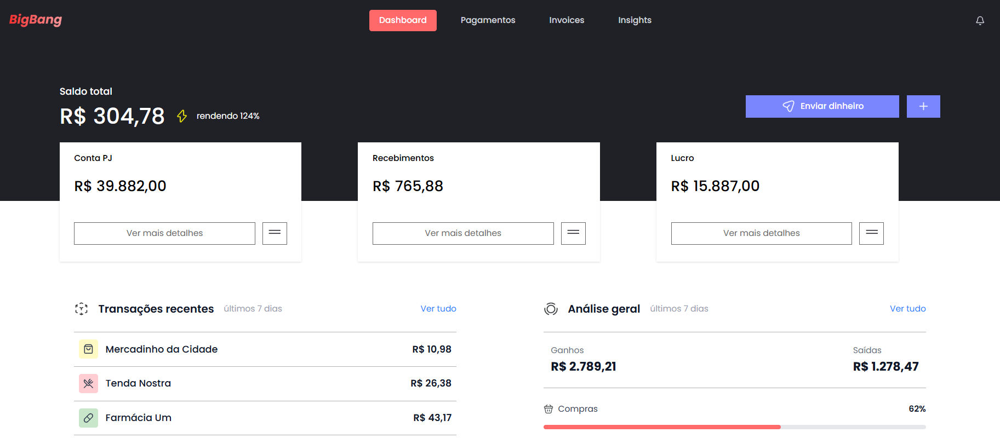
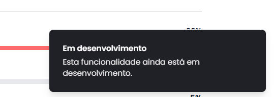
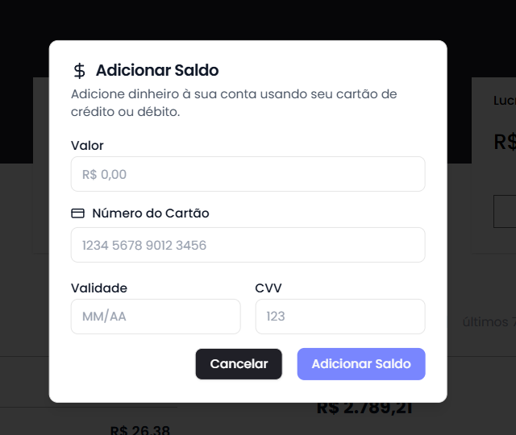
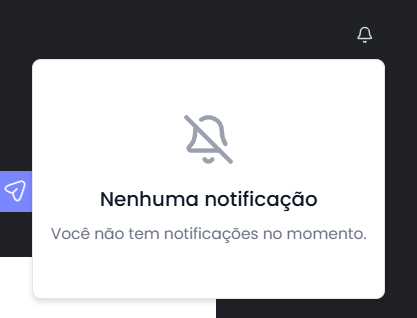
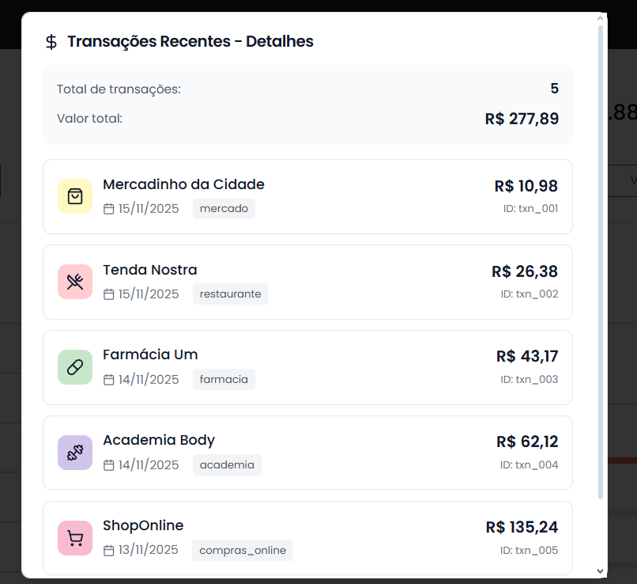

# BigBang - Dashboard Financeiro

 
Arthur Correa - Desenvolvedor
  

Ver: 0.1.0 - Last update: 22/11/2025

 

# Sobre

O projeto é um dashboard financeiro moderno para controle de gastos e receitas. Permite visualizar transações, adicionar saldo, categorizar gastos e acompanhar o fluxo financeiro de forma intuitiva. O projeto utiliza Next.js com App Router e componentes modernos do React.

### Tecnologias

- Node 20+
- Next.js 16.0.3
- React 19.2.0
- TypeScript 5
- Tailwind
- Radix UI
- Lucide React
- Shadcn
- Class Variance Authority
- React Hook Form

 

# Figma Project

## [Clique aqui e veja o figma](https://www.figma.com/design/4Jj8YB96mCmFxGqm46aJ41/Teste-Frontend-BigBang---Figma?node-id=0-1&p=f&t=it4TV123NhhDHVsr-0)

 

# Deploy

## [Clique aqui e veja a aplicação online](https://vercel.com/new?utm_medium=default-template&filter=next.js&utm_source=create-next-app&utm_campaign=create-next-app-readme)

 

# Instalação

Instale as dependências:

~~~
npm install
~~~

Rode o Projeto em desenvolvimento:

~~~
npm run dev
~~~

Build para produção:

~~~
npm run build
~~~

Inicie a aplicação em produção:

~~~
npm start
~~~

Execute o linter:

~~~
npm run lint
~~~

---------

 

## Nomenclatura de commits

- docs: apenas mudanças de documentação;
- feat: uma nova funcionalidade;
- fix: a correção de um bug;
- perf: mudança de código focada em melhorar performance;
- refactor: mudança de código que não adiciona uma funcionalidade e também não corrigi um bug;
- style: mudanças no código que não afetam seu significado (espaço em branco, formatação, ponto e vírgula, etc);
- test: adicionar ou corrigir testes.
---------

## Ultimas funcionalidades adicionadas a mais:

### Toast de feedback para o usuário

### Modal de adição de saldo

### Lista de notificações

### Modal de visualização completa de transações

### Modal de visualização completa da Análise geral

